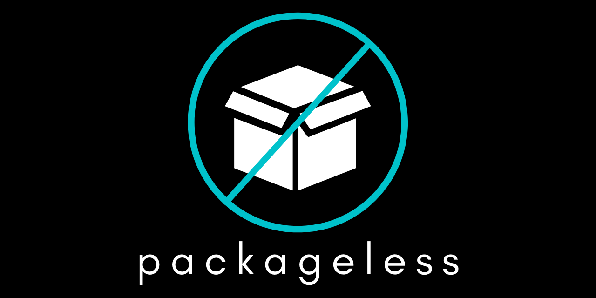

](https://codecov.io/gh/everettraven/packageless)

Thanks for checking out **packageless**! Keep reading for some information about **packageless**.

## What is packageless?
**packageless** is a package manager, but not your traditional package manager. **packageless** doesn't install traditional packages, but rather *package images* or pims. Pims are container images that contain a package and set it as the entrypoint for when the container is ran. When you install a "package" (pim) with **packageless** you are actually just pulling a container image down from a container registry. **packageless** handles the creation of the volumes necessary for the container to run appropriately. **packageless** can even set aliases for you, that way you can use the "packages" (pims) you install the same as you would after installing the package with another package manager.

The currently available pims can be found at [packageless-pims](https://github.com/everettraven/packageless-pims)

## Why packageless?
**packageless** solves a few problems:
- You can now install any package on any OS, as long as the OS can run containers
- Packages are run in an isolated environment
- Makes it easy to install and run multiple different versions of a package

# Development
**packageless** is still in the very early stages of development and functionality is likely to change drastically

# Contributing
Contributing guidelines can be found at: https://everettraven.github.io/packageless/contrib

# Documentation
Documentation can be found at: https://everettraven.github.io/packageless/
